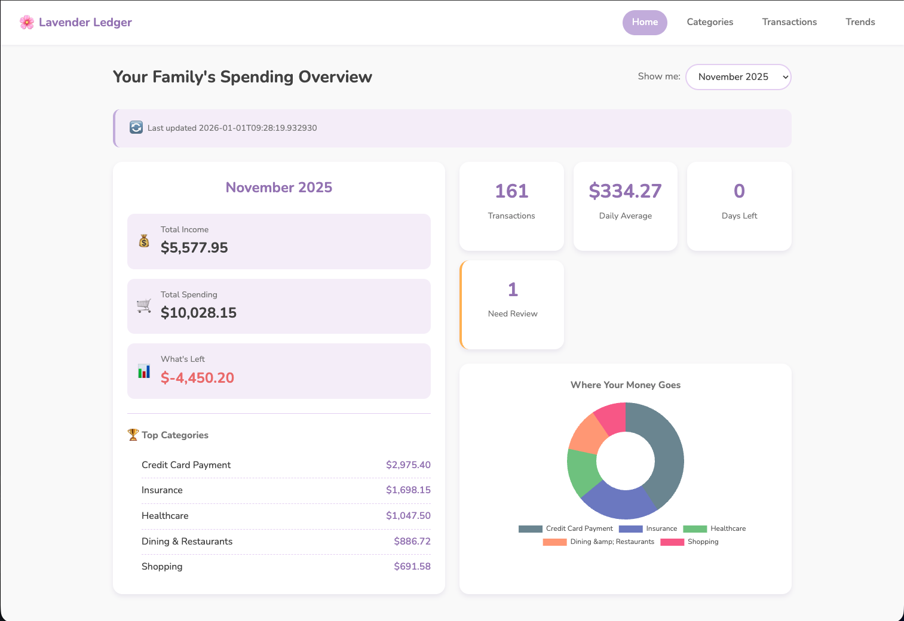
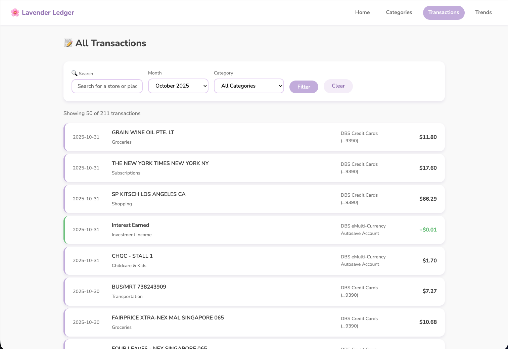

# Lavender Ledger 🌸

**Personal expense tracking powered by Claude Code. No API keys, no config—just intelligent automation.**

Lavender Ledger transforms messy bank statements into beautiful spending insights using Claude Code's native intelligence. Drop PDFs or CSVs into your staging folder, ask Claude to ingest them, and watch as transactions are automatically parsed, categorized, and organized—no spreadsheets, no manual data entry, no complexity.

Built specifically for Claude Code, this isn't just another finance app—it's a demonstration of how AI-native workflows can make personal finance effortless.

---

## 📸 Dashboard Preview

**Home Overview** - See your monthly spending at a glance with colorful charts and top categories:



**Transaction Explorer** - Search, filter, and review all your transactions with ease:



---

## ✨ Features

### Statement Processing
- **PDF & CSV Support** - Parse bank statements from any institution (Chase, Bank of America, DBS, OCBC, UOB, Amex, and more)
- **Automatic Categorization** - Claude AI intelligently categorizes transactions with confidence scores
- **Smart Deduplication** - Prevents duplicate statements and transactions automatically
- **Transaction Memory** - Learns from your patterns over time (Phase 3 feature)
- **Interactive Review** - Flag low-confidence transactions for manual review

### Data Management
- **SQLite Database** - Fast, reliable local storage with automatic migrations
- **Cloud-Synced** - Store data in Dropbox/iCloud for backup and cross-device access
- **Organized Archive** - Statements automatically filed as `archive/{account}/YYYY-MM.{ext}`
- **Audit Trail** - Complete ingestion history with logs and summaries

### Dashboard
- **Family-Friendly Design** - Warm lilac theme with friendly language and emoji icons
- **Read-Only Safety** - Dashboard can't modify data, all editing happens during ingestion
- **Responsive Charts** - Beautiful visualizations with Chart.js
- **Monthly Views** - Navigate through spending history month by month
- **Category Breakdown** - See where your money goes at a glance

### Built for Claude Code
- **No API Keys Required** - Claude Code provides all AI capabilities directly
- **Skills-Based Workflow** - Documented, repeatable processes in markdown
- **Zero Temp Files** - Clean stdin/stdout architecture (no filesystem pollution)
- **Fully Automated** - From PDF to dashboard in one command

## 🚀 Quick Start

### Prerequisites
- Python 3.11+ with [uv](https://github.com/astral-sh/uv) installed
- Claude Code (optional but recommended for ingestion)
- Docker (optional, for dashboard deployment)

### 1. Setup

```bash
# Clone the repository
git clone <repository-url>
cd lavender-ledger

# Install dependencies
uv sync

# Copy configuration
cp config.example.yaml config.yaml
# Edit config.yaml with your data directory path
```

### 2. Initialize Database

```bash
uv run python scripts/init_db.py
```

This creates:
- SQLite database with complete schema
- Default categories (Groceries, Dining, Transportation, etc.)
- Migration tracking table

### 3. Ingest Bank Statements

**With Claude Code (Recommended):**

```bash
# 1. Place PDFs or CSVs in staging folder (configured in config.yaml)
# 2. Stop dashboard if running
docker compose down

# 3. Ask Claude Code:
# "Please run the ingestion skill to process the statements in staging"

# Claude Code will:
# - Read PDFs/CSVs with perfect OCR (no pdfplumber artifacts)
# - Parse account info and transactions
# - Deduplicate against existing data
# - Categorize transactions with AI
# - Auto-create high-confidence rules (≥0.85)
# - Archive statements to organized folders
# - Generate summary report

# 4. Restart dashboard
docker compose up -d dashboard
```

**Without Claude Code:**

See CLAUDE.md for manual workflow using helper scripts.

### 4. View Dashboard

**Local development:**
```bash
uv run python scripts/run_dashboard.py
# Open http://localhost:5000
```

**Docker (for family access):**
```bash
docker compose build
docker compose up -d dashboard
# Open http://your-ip:5000
```

## 📁 Project Structure

```
lavender-ledger/
├── src/
│   ├── dashboard/          # Flask web application
│   │   ├── app.py         # Routes and views
│   │   ├── queries.py     # Read-only database queries
│   │   └── templates/     # Jinja2 templates with lilac theme
│   ├── database/          # Database layer
│   │   ├── schema.sql     # Database schema
│   │   └── models.py      # SQLite access layer
│   └── config.py          # Configuration loader
├── scripts/               # Helper scripts
│   ├── init_db.py        # Database initialization
│   ├── migrate.py        # Migration runner
│   ├── insert_statement.py      # Insert parsed data (accepts stdin)
│   ├── apply_categorizations.py # Apply categories (accepts stdin)
│   ├── archive_pdf.py    # Move statements to archive
│   └── run_dashboard.py  # Local dev server
├── skills/                # Claude Code skills (markdown workflows)
│   ├── ingestion/        # Full ingestion orchestrator
│   ├── pdf_parsing/      # PDF statement parser
│   ├── csv_parsing/      # CSV statement parser
│   └── categorization/   # Transaction categorizer
├── migrations/            # Database migrations
│   ├── README.md         # Migration system docs
│   └── 001_*.sql        # Versioned migrations
├── tests/                 # Test suite (35+ tests)
│   ├── conftest.py       # Shared fixtures
│   ├── test_database_models.py    # Unit tests for database
│   ├── test_dashboard_routes.py   # Frontend integration tests
│   └── test_queries.py   # Dashboard query tests
├── CLAUDE.md              # Claude Code instructions
├── TEST_PLAN.md           # Backend testing strategy
└── FRONTEND_TEST_PLAN.md  # Frontend testing strategy
```

## 🧪 Testing

We have comprehensive test coverage protecting critical functionality:

```bash
# Run all tests (35+ passing)
uv run pytest

# Run with coverage report
uv run pytest --cov=src --cov=scripts --cov-report=term-missing

# Run specific test suite
uv run pytest tests/test_database_models.py -v
uv run pytest tests/test_dashboard_routes.py -v

# Quick test run
uv run pytest -x --tb=short
```

**Test Coverage:**
- ✅ Transaction type validation (prevents deposit/withdrawal bug)
- ✅ Deduplication logic (statements and transactions)
- ✅ Account management
- ✅ Dashboard routes and rendering
- ✅ Read-only enforcement
- ✅ API endpoints

See `TEST_PLAN.md` and `FRONTEND_TEST_PLAN.md` for detailed testing strategies.

## 🔧 Configuration

### config.yaml

```yaml
data_directory: ~/Dropbox/PersonalFinance  # or ~/Library/Mobile Documents/...
database_path: ${data_directory}/finance.db
log_directory: ${data_directory}/logs

statements:
  staging_path: ${data_directory}/statements/staging
  archive_path: ${data_directory}/statements/archive

anthropic:
  api_key: your-api-key-here  # Only needed if not using Claude Code
```

### Environment-Specific Configs

- **Development**: `config.dev.yaml` (uses local `./data` directory)
- **Production**: `config.yaml` (uses cloud-synced directory)

```bash
# Use dev config
ln -sf config.dev.yaml config.yaml
```

## 🐳 Docker Production Setup

The dashboard runs in Docker as a read-only service for family viewing.

### docker-compose.yml

```yaml
services:
  dashboard:
    build: .
    ports:
      - "5000:5000"
    volumes:
      - ~/Dropbox/PersonalFinance:/data:ro  # :ro = read-only
    environment:
      - DATA_DIRECTORY=/data
    restart: unless-stopped
```

### Ingestion Workflow

**Important**: Always stop the dashboard before ingesting to prevent database locking.

```bash
# 1. Stop dashboard
docker compose down

# 2. Ingest new statements (modifies database)
# Ask Claude Code: "Please run the ingestion skill"

# 3. Restart dashboard
docker compose up -d dashboard

# 4. Check logs
docker compose logs -f dashboard
```

## 💾 Database Migrations

The project uses a versioned migration system:

```bash
# Check migration status
uv run python scripts/migrate.py --status

# Apply pending migrations
uv run python scripts/migrate.py
```

**Creating migrations:**
1. Create file: `migrations/{version}_{description}.sql`
2. Add SQL with descriptive header
3. Run `migrate.py` to apply

See `migrations/README.md` for details.

## 🎨 Design System

### Color Palette (Lilac Theme)
- Primary: `#9B7EBD` (Medium lilac)
- Light: `#E6D5F5` (Pale lilac)
- Accent: `#C8B6E2` (Soft lilac)

### Typography
- Headings: Nunito (rounded, friendly)
- Body: System fonts with Quicksand fallback

### UI Patterns
- Rounded corners (16px on cards)
- Soft shadows (no harsh borders)
- Emoji icons throughout (💰, 🛒, 📊)
- Family-friendly language ("Where Your Money Goes" not "Expenditure Analysis")

## 🛠️ Development

### Setup

```bash
# Install dependencies with dev tools
uv sync

# Format code (always run before commit)
uv run black .

# Run tests
uv run pytest

# Run dashboard locally
uv run python scripts/run_dashboard.py
```

### Key Commands

```bash
# Database
uv run python scripts/init_db.py           # Initialize database
uv run python scripts/migrate.py           # Run migrations
sqlite3 ~/Dropbox/PersonalFinance/finance.db  # Direct SQL access

# Testing
uv run pytest -v                           # Verbose test output
uv run pytest --tb=short                   # Short traceback
uv run pytest -x                           # Stop on first failure
uv run pytest --cov=src --cov=scripts      # Coverage report

# Code Quality
uv run black .                             # Format Python
uv run pytest tests/ -v                    # Run all tests
```

## 📖 Documentation

- **CLAUDE.md** - Detailed instructions for Claude Code
- **TEST_PLAN.md** - Backend testing strategy and coverage goals
- **FRONTEND_TEST_PLAN.md** - Dashboard testing approach
- **migrations/README.md** - Migration system documentation

## 🚨 Troubleshooting

### Database locked error
**Cause**: Dashboard still running while trying to ingest.
**Solution**: `docker compose down` before ingestion.

### Temp files accumulating in /tmp/
**Status**: Fixed! ✅ Now uses stdin/stdout (no temp files).

### Transactions missing after CSV import
**Cause**: CSV used "deposit" instead of "income" (invalid type).
**Solution**: Fixed in csv_parsing skill ✅. Tests protect against regression.

### Dashboard shows "No transactions"
**Causes**:
1. Database not initialized: `uv run python scripts/init_db.py`
2. No statements ingested yet: Place PDFs/CSVs in staging and run ingestion
3. Wrong month selected: Use month selector dropdown

### Migration errors
**Solution**: Check `uv run python scripts/migrate.py --status` to see applied vs pending migrations.

## 🔐 Security & Privacy

- **Read-Only Dashboard**: SQLite connection opened with `?mode=ro` flag
- **No Remote API Calls**: All AI processing happens via Claude Code (local)
- **Local Data Storage**: SQLite database, no cloud dependencies
- **Docker Isolation**: Dashboard runs in container with read-only data mount
- **No Forms**: Dashboard has zero POST endpoints (true read-only)

## 🎯 Roadmap

### Phase 1: Foundation (✅ Complete)
- ✅ PDF and CSV ingestion
- ✅ Automatic categorization
- ✅ Read-only dashboard
- ✅ Stdin/stdout refactor (no temp files)
- ✅ Test suite (35+ tests)

### Phase 2: Interactive Review (✅ Complete)
- ✅ Review flagged transactions skill
- ✅ Rule creation from user feedback
- ✅ Auto-rule creation from high-confidence categorizations (≥0.85)
- ✅ Transaction memory template (TRANSACTION_MEMORY.template.md)
- ✅ Migration 002: Enhanced categorization rules with complex conditions

### Phase 3: Memory-Enhanced Categorization (✅ Complete)
- ✅ Load transaction memory during categorization
- ✅ Context-aware confidence scoring with memory-based adjustments
- ✅ Merchant pattern learning and preference tracking
- ✅ Time-based and amount-based categorization rules
- ✅ Personal context integration (location, household, payment methods)

### Phase 4: Advanced Features (Future)
- [ ] Memory management skill
- [ ] Rule performance dashboard
- [ ] Smart rule suggestions
- [ ] Multi-currency support
- [ ] Budget tracking

## 🤝 Contributing

This is a personal project, but contributions are welcome!

1. Fork the repository
2. Create a feature branch
3. Run tests: `uv run pytest`
4. Format code: `uv run black .`
5. Submit a pull request

## 📄 License

MIT License - see LICENSE file for details.

---

**Built with Claude Code** 🤖 | **Designed for families** 👨‍👩‍👧‍👦 | **Zero temp files** 🗑️✨
